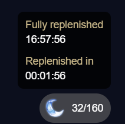

# Genshin Resin

### Adds information about original resin to hoyolab.

### <a href="https://genshin-api.superzombi.repl.co/docs">Documentation</a>

### Install via Tampermonkey:
1. Install **[Tampermonkey](https://www.tampermonkey.net/)**.
2. Install **[Script](https://raw.githubusercontent.com/SuperZombi/genshin-resin-api/main/genshin-resin.user.js)**.
