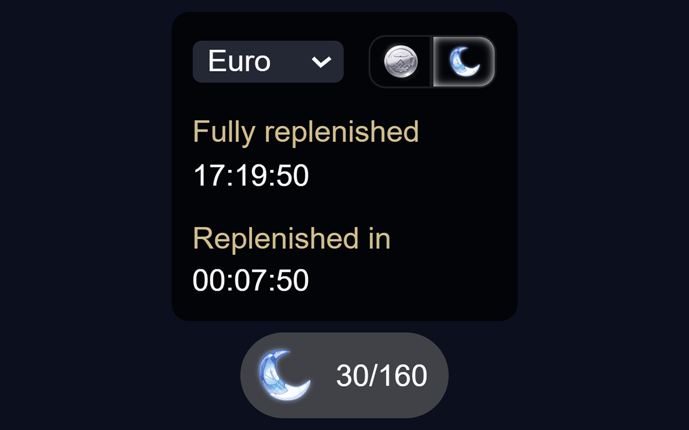

# Genshin Resin

### Adds information about original resin to hoyolab.

<p align="right">
    
    <a href="#donate"></a>
</p>
<p align="center">
    
</p>

## Installation:
### Chrome:
  1. Download latest **[Release](https://github.com/SuperZombi/genshin-resin-api/releases)**.
  2. Extract the archive to an installation location.
  3. ```⋮``` > "Additional tools" > "Extensions".
  4. Turn on "Developer Mode".
  5. Press "Load unpacked extension".
  6. Select the path to the unpacked folder.

### Tampermonkey:
  1. Install **[Tampermonkey](https://www.tampermonkey.net/)**.
  2. Install **[Script](https://raw.githubusercontent.com/SuperZombi/genshin-resin-api/main/genshin-resin.user.js)**.

<hr>

### <a href="https://genshin-api.superzombi.repl.co/docs">API Documentation</a>

<hr>

#### 💲Donate

<table>
  <tr>
    <td>
       
    </td>
    <td>
      <a href="https://donatello.to/super_zombi">Donatello</a>
    </td>
  </tr>
  <tr>
    <td>
       
    </td>
    <td>
      <a href="https://www.donationalerts.com/r/super_zombi">Donation Alerts</a>
    </td>
  </tr>
</table>
    
(But now it's better to email me and I'll send you the details)
